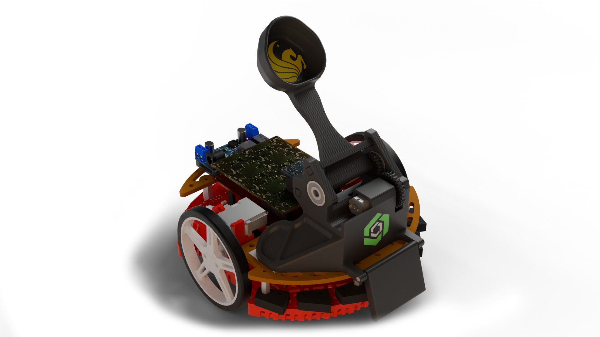

# Duck Launcher

Code ran on my teams robot for the UCF EGN1006C Final project in which we placed first in the entire spring semester of 2025, scoring 30,500 points with 81 ducks.

This is a full revamp of the example code and includes a full PID instead of just a P value.
It also doesn't use the gyro as many of them were faulty and not worth the extra risk and hassle.

It is hyper optimized to only follow the line there, shoot upon limit switch activation, and follow the line back.

## Using this code
I do not reccommend using this code.
While it did work very well for us it is very messy and I would recommend to only use this code as a refrence.

However if you really want to use this code you will need to tune the PID values with a straight line and restructure it slightly wether you are using a motor/server or a fully mechanical launcher.

## The Launcher
The launcher was a made with a very cheap brushed dc motor, a relay, and a couple of bearings. The model and motor can be found below:

[200RPM N20 DC 3V Motor](https://a.co/d/iVoOINC) (We ran it at 5V so the RPM is slightly higher)

[CAD Model - Onshape](https://cad.onshape.com/documents/fea657253e3efcf7a8011b18/w/9f6b0cfca8e076060c58e5d4/e/e4dd6842f8802302730311c8)

## Scoring Website
There is also a very basic score keeping html file included and hosted on my [github pages](https://purerandomgit.github.io/DuckLaucher/). It is very basic and made last minute but the core functionality of the timer and score keeping aspects work correctly. The extra bits like the score breakdown and charts do not work fully and will normally break if the timer is paused.

